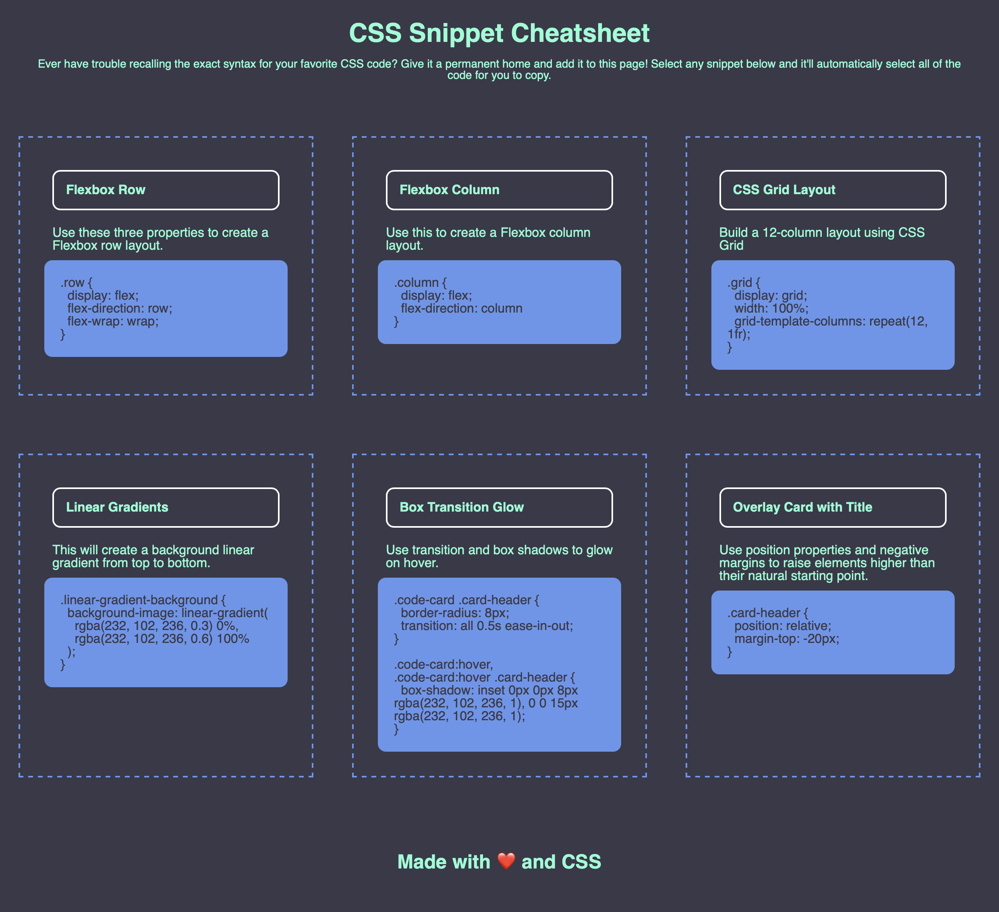

### CSS-Snippet-Cheatsheet

Site contains some helpful CSS Snippets, displayed in a chart. 

## Table of Contents:

- [Tecnologies](#technologies)
- [Picture of Site](#picture-of-site)
- [Links](#links)
- [License](#license)
- [Questions](#questions)

### Technologies

1. jQuery
2. CSS
3. HTML

### Picture of site

### Links:

Website:

https://karenharley.github.io/CSS-Snippet-Cheatsheet

Github:

https://github.com/KarenHarley/CSS-Snippet-Cheatsheet

### License

The license used for this project: MIT

### Questions

To reach me please contact me in the email address below!

- GitHub: https://github.com/KarenHarley
- Email: karenharley88@gmail.com
